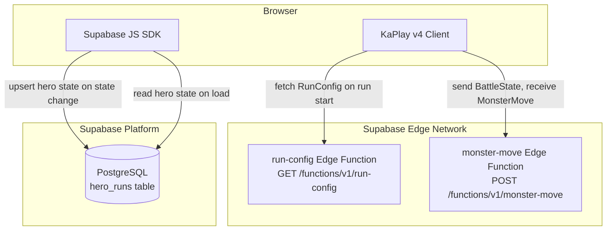
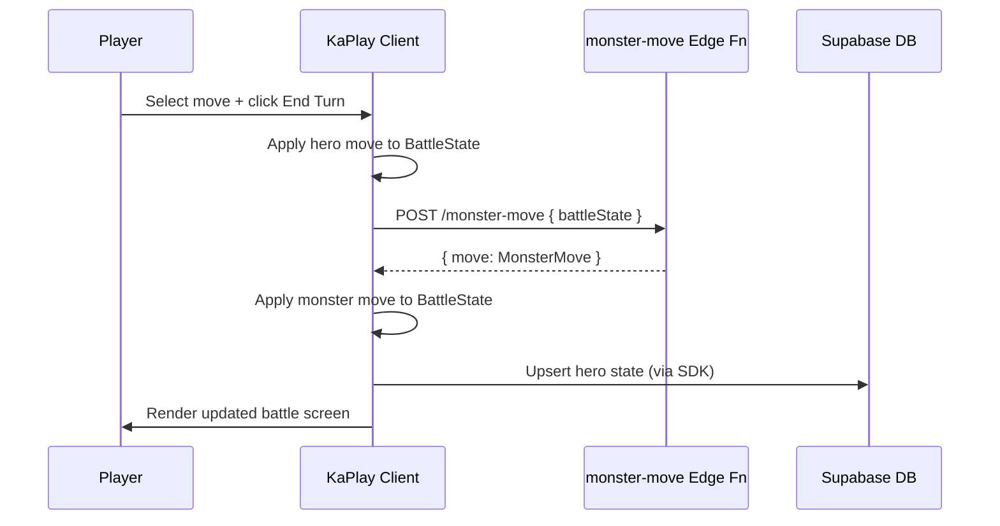

# Design Document: RPG Gauntlet Game

## Overview

RPG Gauntlet is a browser-based 2D turn-based RPG built with [KaPlay v4](https://v4000.kaplayjs.com) on the frontend and [Supabase Edge Functions](https://supabase.com/docs/guides/functions) (Deno runtime) on the backend. A knight fights through a gauntlet of 5 monsters in sequence. The player selects moves each turn; the server drives monster AI and run configuration. After each battle the hero learns a move from the defeated monster, earns XP, and may level up.

### Key Architectural Decisions

- **No Node/Express server.** All backend logic lives in two Supabase Edge Functions: `run-config` (GET) and `monster-move` (POST).
- **Client-side state writes.** The client writes hero state directly to Supabase PostgreSQL via the Supabase JS SDK. No server-side persistence layer is needed.
- **KaPlay handles everything visual.** Scenes, sprites, animations, UI cards, and input are all managed by KaPlay's component-entity system.
- **Stateless edge functions.** Both functions are pure request/response — they receive data, compute a result, and return it. No session state is held server-side.
- **KaPlay Crew sprites for placeholders.** Character sprites use the [KaPlay Crew](https://v4000.kaplayjs.com/docs/guides/crew/) built-in sprite set until final assets are swapped in. Each character maps to a crew member sprite.

---

## Architecture



### Request Flow — Turn Cycle



---

## Components and Interfaces

### Scene Graph (KaPlay Scenes)

KaPlay uses a scene-based architecture. Each screen is a named scene registered with `scene()` and entered with `go()`.

| Scene Name       | Purpose                                              |
|------------------|------------------------------------------------------|
| `main-menu`      | Title screen with Start Run / Exit                   |
| `run-overview`   | Map screen listing 5 encounter nodes                 |
| `move-management`| Overlay/scene for swapping moves in/out of moveset   |
| `battle`         | Core combat screen                                   |
| `post-battle`    | Move learning + XP display after a win               |
| `victory`        | Run complete screen                                  |
| `defeat`         | Battle lost screen with retry option                 |

### Client Modules

```
src/
  main.ts                  # KaPlay init, asset loading, scene registration
  scenes/
    mainMenu.ts
    runOverview.ts
    moveManagement.ts
    battle.ts
    postBattle.ts
    victory.ts
    defeat.ts
  game/
    combat.ts              # Damage/healing calculations (pure functions)
    moveManager.ts         # Move pool and moveset swap logic
    heroState.ts           # Hero stat management, XP, level-up
    runState.ts            # Active run tracking (current monster index, etc.)
  api/
    runConfig.ts           # fetch() wrapper for GET /run-config
    monsterMove.ts         # fetch() wrapper for POST /monster-move
  db/
    persistence.ts         # Supabase SDK calls (upsert/read hero_runs)
  types/
    index.ts               # Shared TypeScript types
```

### Edge Functions

```
supabase/functions/
  run-config/
    index.ts               # GET handler — returns RunConfig
  monster-move/
    index.ts               # POST handler — receives BattleState, returns MonsterMove
```

### API Contracts

#### `GET /functions/v1/run-config`

Response `200 OK`:
```json
{
  "monsters": [
    {
      "id": "goblin-warrior",
      "name": "Goblin Warrior",
      "stats": { "health": 60, "attack": 12, "defense": 5, "magic": 3 },
      "moveset": [
        { "id": "rusty-blade", "name": "Rusty Blade", "type": "physical", "baseValue": 8, "effect": null },
        { "id": "dirty-kick",  "name": "Dirty Kick",  "type": "physical", "baseValue": 4,
          "effect": { "kind": "debuff", "stat": "defense", "amount": 3, "turns": 2 } },
        { "id": "frenzy",      "name": "Frenzy",      "type": "buff",     "baseValue": 0,
          "effect": { "kind": "buff",   "stat": "attack",  "amount": 5, "turns": 2 } },
        { "id": "headbutt",    "name": "Headbutt",    "type": "physical", "baseValue": 14, "effect": null }
      ]
    }
    // ... 4 more monsters in encounter order
  ]
}
```

#### `POST /functions/v1/monster-move`

Request body:
```json
{
  "monsterId": "goblin-warrior",
  "monsterStats": { "health": 45, "attack": 12, "defense": 5, "magic": 3 },
  "monsterMoveset": [ /* array of Move */ ],
  "heroStats": { "health": 80, "attack": 15, "defense": 8, "magic": 6 },
  "activeBuffs": [ /* array of ActiveEffect */ ],
  "turnNumber": 3
}
```

Response `200 OK`:
```json
{
  "move": {
    "id": "headbutt",
    "name": "Headbutt",
    "type": "physical",
    "baseValue": 14,
    "effect": null
  }
}
```

Response `400 Bad Request` (malformed body):
```json
{
  "error": "Missing required field: monsterId"
}
```

---

## Data Models

### TypeScript Types (`src/types/index.ts`)

```typescript
// ── Stat block ──────────────────────────────────────────────────────────────
export interface Stats {
  health: number;
  maxHealth: number;
  attack: number;
  defense: number;
  magic: number;
}

// ── Move ────────────────────────────────────────────────────────────────────
export type MoveType = "physical" | "magic" | "buff" | "debuff";
export type StatKey = "attack" | "defense" | "magic" | "health";

export interface MoveEffect {
  kind: "buff" | "debuff" | "drain"; // drain = damage + self-heal
  stat: StatKey;
  amount: number;
  turns: number;
}

export interface Move {
  id: string;
  name: string;
  type: MoveType;
  baseValue: number;       // 0 for pure buff/debuff moves
  effect: MoveEffect | null;
}

// ── Active buff/debuff on a character ───────────────────────────────────────
export interface ActiveEffect {
  stat: StatKey;
  delta: number;           // positive = buff, negative = debuff
  turnsRemaining: number;
  originalValue: number;   // stat value before the effect was applied
}

// ── Hero ─────────────────────────────────────────────────────────────────────
export interface Hero {
  level: number;
  xp: number;
  xpToNextLevel: number;
  baseStats: Stats;
  currentStats: Stats;     // includes active buff/debuff modifications
  moveset: [Move, Move, Move, Move]; // always exactly 4
  movePool: Move[];
  activeEffects: ActiveEffect[];
}

// ── Monster ──────────────────────────────────────────────────────────────────
export interface Monster {
  id: string;
  name: string;
  baseStats: Stats;
  currentStats: Stats;
  moveset: [Move, Move, Move, Move];
  activeEffects: ActiveEffect[];
}

// ── Run Config (from server) ─────────────────────────────────────────────────
export interface RunConfig {
  monsters: Monster[];     // length === 5, in encounter order
}

// ── Battle State (sent to monster-move endpoint) ─────────────────────────────
export interface BattleState {
  monsterId: string;
  monsterStats: Stats;
  monsterMoveset: Move[];
  heroStats: Stats;
  activeBuffs: ActiveEffect[];
  turnNumber: number;
}

// ── Run State (client-side) ──────────────────────────────────────────────────
export interface RunState {
  runId: string;
  hero: Hero;
  runConfig: RunConfig;
  currentMonsterIndex: number; // 0–4
  isComplete: boolean;
}

// ── Database row (hero_runs table) ───────────────────────────────────────────
export interface HeroRunRow {
  id: string;              // UUID, run ID
  hero_level: number;
  hero_xp: number;
  hero_stats: Stats;       // stored as JSONB
  move_pool: Move[];       // stored as JSONB
  active_moveset: Move[];  // stored as JSONB
  current_monster_index: number;
  is_complete: boolean;
  created_at: string;
  updated_at: string;
}
```

### Database Schema

```sql
create table hero_runs (
  id                    uuid primary key default gen_random_uuid(),
  hero_level            integer not null default 1,
  hero_xp               integer not null default 0,
  hero_stats            jsonb   not null,
  move_pool             jsonb   not null default '[]',
  active_moveset        jsonb   not null,
  current_monster_index integer not null default 0,
  is_complete           boolean not null default false,
  created_at            timestamptz not null default now(),
  updated_at            timestamptz not null default now()
);
```

### XP and Level-Up Constants

| Level | XP Threshold | Attack Gain | Defense Gain | Health Gain | Magic Gain |
|-------|-------------|-------------|--------------|-------------|------------|
| 1→2   | 100         | +3          | +2           | +15         | +2         |
| 2→3   | 250         | +3          | +2           | +15         | +2         |
| 3→4   | 450         | +4          | +3           | +20         | +3         |
| 4→5   | 700         | +4          | +3           | +20         | +3         |

XP awarded per battle: `50 * monsterIndex + 50` (Monster 1 = 50 XP, Monster 5 = 250 XP).

### Hero Starting Stats

| Stat    | Value |
|---------|-------|
| Health  | 100   |
| Attack  | 12    |
| Defense | 8     |
| Magic   | 8     |

### Monster Stat Progression

| # | Monster       | HP  | ATK | DEF | MAG |
|---|---------------|-----|-----|-----|-----|
| 1 | Goblin Warrior| 60  | 12  | 5   | 3   |
| 2 | Giant Spider  | 80  | 15  | 7   | 4   |
| 3 | Witch         | 90  | 10  | 6   | 18  |
| 4 | Dragon        | 120 | 20  | 14  | 16  |
| 5 | Goblin Mage   | 100 | 12  | 10  | 22  |

### Sprite Mapping (KaPlay Crew — Placeholder)

Characters use the [KaPlay Crew](https://v4000.kaplayjs.com/docs/guides/crew/) built-in sprites loaded via `loadSprite` with the crew sprite sheet. Swap out the sprite keys when final assets are ready.

| Character      | Crew Sprite Key  |
|----------------|------------------|
| Knight (hero)  | `"bean"`         |
| Goblin Warrior | `"bobo"`         |
| Giant Spider   | `"ghosty"`       |
| Witch          | `"wunky"`        |
| Dragon         | `"dino"`         |
| Goblin Mage    | `"gigagantrum"`  |

Loading example in `main.ts`:
```typescript
loadSprite("bean",       "/sprites/crew/bean.png");
loadSprite("bobo",       "/sprites/crew/bobo.png");
loadSprite("ghosty",     "/sprites/crew/ghosty.png");
loadSprite("wunky",      "/sprites/crew/wunky.png");
loadSprite("dino",       "/sprites/crew/dino.png");
loadSprite("gigagantrum","/sprites/crew/gigagantrum.png");
```


---

## Correctness Properties

*A property is a characteristic or behavior that should hold true across all valid executions of a system — essentially, a formal statement about what the system should do. Properties serve as the bridge between human-readable specifications and machine-verifiable correctness guarantees.*

### Property 1: Physical damage formula

*For any* attacker with a given `attack` stat, a target with a given `defense` stat, and a physical move with a given `baseValue`, the calculated damage must equal `max(1, baseValue * attack - defense)`.

**Validates: Requirements 7.1**

---

### Property 2: Magic damage ignores defense

*For any* caster with a given `magic` stat, a target with any `defense` value, and a magic damage move with a given `baseValue`, the calculated damage must equal `baseValue * magic` regardless of the target's defense.

**Validates: Requirements 7.2**

---

### Property 3: Magic healing is capped at max health

*For any* caster with a given `magic` stat, `currentHealth`, and `maxHealth`, and a healing move with a given `baseValue`, the resulting health must equal `min(maxHealth, currentHealth + baseValue * magic)`.

**Validates: Requirements 7.3**

---

### Property 4: Buff/debuff application and expiry round-trip

*For any* character stat, effect amount, and duration, applying a buff or debuff should change the stat by the defined amount; after the effect's `turnsRemaining` reaches 0, the stat must be restored to its exact pre-effect value (`originalValue`).

**Validates: Requirements 7.4, 7.5, 7.6**

---

### Property 5: Hero starts every run with the default moveset

*For any* new run initialization, the hero's active moveset must contain exactly the four moves: Slash, Shield Up, Battle Cry, and Second Wind — in any order.

**Validates: Requirements 8.1**

---

### Property 6: Monster-move endpoint returns a move from the monster's moveset

*For any* valid `BattleState`, the `POST /functions/v1/monster-move` endpoint must return a move whose `id` is present in the `monsterMoveset` array of that `BattleState`.

**Validates: Requirements 5.3, 6.2**

---

### Property 7: Monster-move endpoint rejects malformed requests

*For any* request body that is missing one or more required fields (`monsterId`, `monsterStats`, `monsterMoveset`, `heroStats`, `turnNumber`), the endpoint must return HTTP 400 with a non-empty `error` string.

**Validates: Requirements 6.4**

---

### Property 8: Run config monsters are in strictly increasing difficulty order

*For any* `RunConfig` returned by `GET /functions/v1/run-config`, for every adjacent pair of monsters at indices `i` and `i+1`, the sum of `monster[i+1]`'s base stats must be strictly greater than the sum of `monster[i]`'s base stats.

**Validates: Requirements 2.3**

---

### Property 9: Move learning adds the move to the hero's pool

*For any* monster and any move selected from that monster's moveset as the learned move, after post-battle processing the hero's `movePool` must contain that move, and the post-battle screen render must include the move's name.

**Validates: Requirements 10.1, 10.2, 10.3**

---

### Property 10: XP award and level-up correctness

*For any* hero at any level, winning a battle against monster at index `i` must award exactly `50 * (i + 1)` XP; if the resulting total XP meets or exceeds `xpToNextLevel`, a level-up must be triggered and each of the hero's four stats must increase by the defined amounts for that level transition.

**Validates: Requirements 11.1, 11.2, 11.3**

---

### Property 11: Moveset invariant — always exactly 4 unique moves

*For any* sequence of valid move swaps in Move Management, the hero's active moveset must always contain exactly 4 moves and must never contain duplicate move `id` values.

**Validates: Requirements 12.1, 12.3, 12.4**

---

### Property 12: Hero state persistence round-trip

*For any* hero state change (level-up, move learned, battle won), after the client persists the state to the database via the Supabase SDK, reading the row back must produce a `HeroRunRow` whose fields match the in-memory `Hero` state exactly.

**Validates: Requirements 13.2**

---

### Property 13: Battle retry preserves hero progression

*For any* hero state and any battle, retrying the battle must reset the monster's HP to its maximum and the turn counter to 1, while the hero's level, stats, move pool, and active moveset remain unchanged from before the retry.

**Validates: Requirements 14.3**

---

## Error Handling

### Client-Side

| Scenario | Handling |
|---|---|
| `GET /run-config` fails or times out | Show error overlay with "Retry" button; do not transition to run-overview |
| `POST /monster-move` fails or times out | Retry up to 2 times with 500ms backoff; if all retries fail, show error overlay with "Retry Turn" option |
| Supabase SDK write fails | Log error to console; show non-blocking toast notification; continue gameplay (state is in memory) |
| Supabase SDK read fails on load | Start a fresh run rather than blocking the player |
| Monster HP drops below 0 | Clamp to 0 before checking win condition |
| Hero HP drops below 0 | Clamp to 0 before checking loss condition |
| Move swap with invalid move id | Silently reject; log warning |

### Server-Side (Edge Functions)

| Scenario | Handling |
|---|---|
| Missing required field in `POST /monster-move` body | Return `400` with `{ "error": "Missing required field: <fieldName>" }` |
| `monsterMoveset` is empty | Return `400` with `{ "error": "monsterMoveset must not be empty" }` |
| Unhandled exception in Edge Function | Deno runtime returns `500`; client treats as transient failure and retries |

---

## Testing Strategy

### Dual Testing Approach

Both unit/example tests and property-based tests are used. Unit tests cover specific scenarios, edge cases, and integration points. Property tests verify universal correctness across generated inputs.

### Property-Based Testing Library

**[fast-check](https://fast-check.dev/)** (TypeScript) — runs in the browser and Node.js, integrates with Vitest.

Each property test is configured to run a minimum of **100 iterations**.

Tag format for each property test:
```
// Feature: rpg-gauntlet-game, Property N: <property_text>
```

### Unit / Example Tests

Focus areas:
- Scene transitions (main menu → run overview → battle → post-battle)
- Default hero moveset initialization
- Defeat and victory screen rendering
- Level-up notification display
- Move Management UI interactions (swap, duplicate prevention)
- `POST /monster-move` integration test (1–2 real calls verifying response shape)
- `GET /run-config` integration test (verify 5 monsters, 4 moves each)

### Property Tests

Each property from the Correctness Properties section maps to one property-based test:

| Property | Module Under Test | Generators |
|---|---|---|
| P1: Physical damage formula | `combat.ts` → `calcPhysicalDamage` | arbitrary attack, defense, baseValue integers |
| P2: Magic damage ignores defense | `combat.ts` → `calcMagicDamage` | arbitrary magic, defense, baseValue integers |
| P3: Magic healing capped | `combat.ts` → `calcMagicHeal` | arbitrary magic, currentHealth, maxHealth, baseValue |
| P4: Buff/debuff round-trip | `combat.ts` → `applyEffect`, `tickEffects` | arbitrary stat, delta, turns |
| P5: Default moveset on new run | `heroState.ts` → `initHero` | arbitrary run seed |
| P6: Monster-move returns valid move | `monster-move` Edge Fn (unit, mocked) | arbitrary valid BattleState |
| P7: Monster-move rejects malformed | `monster-move` Edge Fn (unit) | arbitrary objects with missing fields |
| P8: RunConfig difficulty ordering | `run-config` Edge Fn (unit) | deterministic (single call, assert ordering) |
| P9: Move learning round-trip | `heroState.ts` → `learnMove` | arbitrary monster + moveset |
| P10: XP and level-up | `heroState.ts` → `awardXP`, `checkLevelUp` | arbitrary hero level, xp, monsterIndex |
| P11: Moveset invariant | `moveManager.ts` → `swapMove` | arbitrary move pool + swap sequences |
| P12: Persistence round-trip | `persistence.ts` (mocked Supabase SDK) | arbitrary HeroState |
| P13: Battle retry preserves hero | `runState.ts` → `retryBattle` | arbitrary hero state + battle context |

### Integration Tests

- `GET /run-config` — verify endpoint returns 200, 5 monsters, 4 moves each, within 500ms
- `POST /monster-move` — verify endpoint returns 200 with a valid move within 300ms
- Supabase DB — verify `hero_runs` table schema and RLS policies

### Test File Structure

```
src/
  __tests__/
    combat.property.test.ts      # P1, P2, P3, P4
    heroState.property.test.ts   # P5, P9, P10
    moveManager.property.test.ts # P11
    persistence.property.test.ts # P12
    runState.property.test.ts    # P13
    combat.unit.test.ts          # default move examples, edge cases
    scenes.unit.test.ts          # scene transition examples
supabase/functions/
  __tests__/
    run-config.property.test.ts  # P8
    monster-move.property.test.ts # P6, P7
    integration.test.ts          # live endpoint integration tests
```
